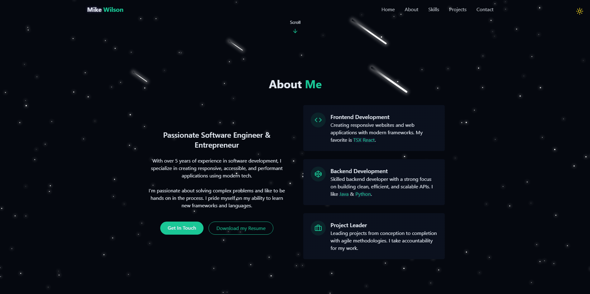

# Mike Wilson – Developer Portfolio 🌐

Welcome to my personal developer portfolio, built using **React**, **TypeScript**, and **Tailwind CSS**. This site showcases my background, skills, and projects, and serves as a central hub for connecting with me professionally.

---

## 📸 Screenshot

---

## 🚀 Live Website

Check out the live site here:  
👉 [https://michaelawilson.vercel.app/](https://michaelawilson.vercel.app/)

---

## 🛠️ Built With

- [React](https://reactjs.org/)
- [TypeScript](https://www.typescriptlang.org/)
- [Tailwind CSS](https://tailwindcss.com/)
- [Vite](https://vitejs.dev/)
- [Lucide Icons](https://lucide.dev/)

---

## ✨ Features

- Dark mode toggle with smooth transitions 🌙☀️
- Animated star & meteor background
- Responsive design for all screen sizes
- Smooth scroll navigation
- Highlighted projects and contact section

---

## 📬 Contact

Want to connect or collaborate?  
Reach me at: [mawilson0410@gmail.com](mailto:mawilson0410@gmail.com)  
Or find me on [LinkedIn](https://www.linkedin.com/in/michael-wilson-0bb38b208/)

---

## 🧾 License

This project is open for inspiration and reuse, but please credit appropriately. 🙏
